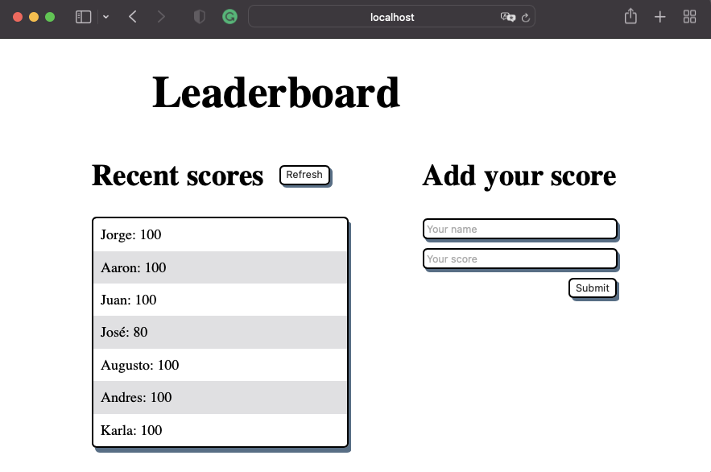

# Leaderboard

> In this project, I built a Leaderboard list app, using webpack and ES6 features, notably modules. .

## Screenshot



## Built With

- HTML
- CSS
- JavaScript
- Webpack
<!-- 
## Getting Started
For a live demo [click here](https://alexr16.github.io/To-Do-list/) -->
## Getting Started

To get a local copy up and running follow this simple step:

Clone repository to your local machine: `git@github.com:Alexr16/To-Do-list.git`

### Run project

```bash
$ npm install
$ npm run start # this will make webpack watching for your changes in code
```

### Open page in browser
```bash
$ open dist/index.html
```
## Author

👤 **George**

- GitHub: [@Alexr16](https://github.com/Alexr16)


## 🤝 Contributing

Contributions, issues, and feature requests are welcome!

Feel free to check the [issues page](../../issues/).

## Show your support

Give a ⭐️ if you like this project!


## 📝 License

This project is [MIT](./MIT.md) licensed.